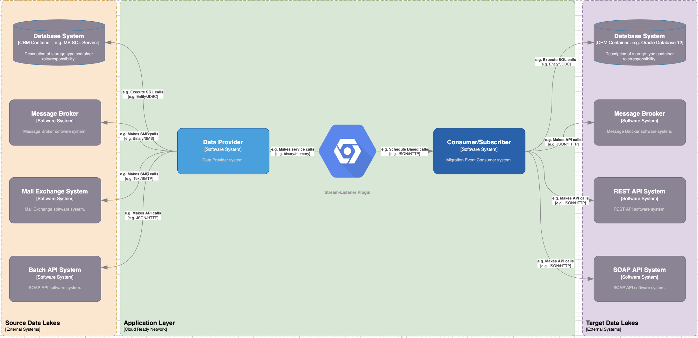
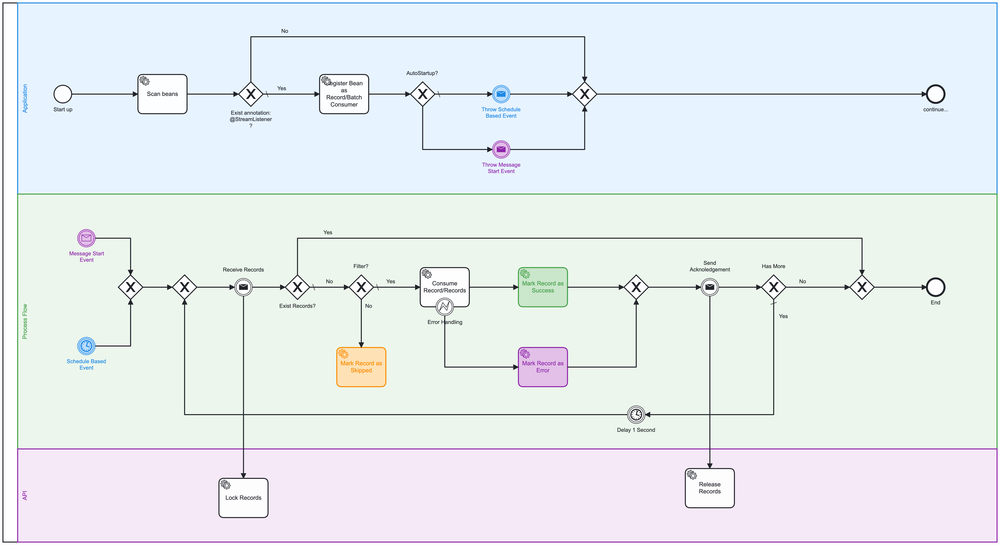

# Stream-Listener Library

## 1 - Introduction and Goals

* Event subscribers should handle a large of numbers of events by pulling the self. 
* The all logic and configuration should be provided via plugin.

### Requirements Overview

* The all logic and configuration should be provided via plugin.
* Should handle a record consumer.
* Should handle a batch consumer.
* The pull and commit should be part of plugin.
* Usage of plugin should match nearly to Kafka Listener logic, so that the migration to kafka can be seamless.

## 2 - Architecture Constraints

### Branching Model

* Git Flow

### Build Tool

* Maven

### Test Coverage (Line)

* 85 %

### Frameworks & Tools
* Java 17
* Spring boot 3.0
* Maven 3

### DoD

* Package by Feature
* No TODO's or FIXME are present in code
* No Dead, commented or unused code are present
* No warnings are present
* Use standard Code Formatter from IDEA
* Follow Java Style Guide
* Use english for Programing language
* Use english for documentation

### Guidelines

* `https://google.github.io/styleguide/javaguide.html`
* Follow SOLID Patterns
* S - Single-responsibility Principle
* O - Open-closed Principle
* L - Liskov Substitution Principle
* I - Interface Segregation Principle
* D - Dependency Inversion Principle
* Follow KISS Patterns
* Follow DRY Patterns

## 3 - Context and scope



Producer and Consumer as decoupled services
The Event Producer subscribe for specific topic and get notified on new record(s) using the "stream-listenr-plugin".
Once record(s) are received it will send to the consumer configured on this topic via REST, and it will mark record(s)
as success or error regarding to the response from event-consumer.

One best practice to decouple components is to use a stream and build an event based architecture (service choreography).
In such a service choreography the only communication path that exists is the connection of each service to the stream.
Each service then published events on the stream and don’t cares what happen with these records.
Other services subscribe to the stream and decide by their own how to react on a certain record.

Producer and Consumer as coupled services
The Event Producer/Consumer subscribe for specific topic and get notified on new record(s) using the "stream-listenr-plugin".
Once record(s) are received it will react on a certain record and it will mark it
as success or error regarding to the exception handling on event-consumer.

### Business context

This library may be used in other implementation and speed up the development.

### Technical context

Consumers pull events in batch modus via plugin from different endpoints.

Endpoint may be Rest Service, Database Repositories, Filesystem or Subscribers from message broker

Consumer need to configure the topics, group, id, etc.

## 4 - Solution Strategy

### BeanPostProcessor
we'll define the BeanPostProcessor which will check each bean for the Subscriber annotation. This class is also a DestructionAwareBeanPostProcessor, which is a Spring interface adding a before-destruction callback to BeanPostProcessor. If the annotation is present, we'll register it with the Endpoint identified by the annotation's SpEL expression on bean initialization and unregister it on bean destruction:

## 5 - Building Block View


#### @StreamListener

* Annotation that marks a method to be registered as listener. Exactly one of the topic attribute must be specified.
* The annotated method must expect arguments of typo single record or collection of records.
* It will typically have a void return type; if not, the returned value will be ignored when called through the factory.

```
public class InvoiceListener {    
     
    @StreamListener("dwh_invoice_created")
    public void on(InvouceEvent event) { 
        ---
    }
}
```

application.properties
```
stream-listener.name=dwh
stream-listener.id=invoice-consumer_1
stream-listener.batch=true
```

##### Configuration
| Name | Type | Required | Default Value | Description |
| --- | --- | --- | --- | --- |
| topics |	array<string> |	true |	empty | The topics for this listener. The entries can be 'topic name', 'property-placeholder keys' or 'expressions'. An expression must be resolved to the topic name. |
| id | string | false | empty | The unique identifier of the container for this listener. If none is specified an auto-generated id is used SpEL {@code #{...}} and property place holders {@code ${...}} are supported. |
| name | string	|false|	empty |Spring application name topics	array<string>	true	empty The topics for this listener. The entries can be 'topic name', 'property-placeholder keys' or 'expressions'. An expression must be resolved to the topic name. |
| errorHandler	| object | false	| null | Set an {@link StreamEventListenerErrorHandler} bean name to invoke if the listener method throws an exception. If a SpEL expression is provided ({@code #{...}}), the expression can either evaluate to a {StreamEventListenerErrorHandler} instance or a bean name. |
| groupId |	string | false | empty | Override the {@code group.id} property for the consumer factory with this value for this listener only. SpEL {@code #{...}} and property place holders {@code ${...}} are supported. concurrency	string	false	empty	Override the container factory's {@code concurrency} setting for this listener. May be a property placeholder or SpEL expression that evaluates to a {@link Number}, in which case {@link Number#intValue()} is used to obtain the value. SpEL {@code #{...}} and property place holders {@code ${...}} are supported. autoStartup	boolean	false false	Set to true or false, to override the default setting in the container factory. May be a property placeholder or SpEL expression that evaluates to a {@link Boolean} or a {@link String}, in which case the {@link Boolean#parseBoolean(String)} is used to obtain the value. SpEL {@code #{...}} and property place holders {@code ${...}} are supported. |
| properties |	array<string>|	false|	empty | Stream consumer properties; they will supersede any properties with the same name defined in the consumer factory (if the consumer factory supports property overrides). Supported Syntax The supported syntax for key-value pairs is the same as the syntax defined for entries in a Java {@linkplain java.util.Properties#load(java.io.Reader) properties file}: {@code key=value} {@code key:value}  {@code key value} {@code group.id} and {@code client.id} are ignored. SpEL {@code #{...}} and property place holders {@code ${...}} are supported. SpEL expressions must resolve to a {@link String}, a @{link String[]} or a {@code Collection<String>} where each member of the array or collection is a property name + value with the above formats. |
| batch |	boolean	| false	| auto | The listener method signature should receive a {@code List<?>}; refer to the reference documentation. This allows a single container factory to be used for both record and batch listeners; previously separate container factories were required. @return "true" for the annotated method to be a batch listener or "false" for a record listener. If not set, the container factory setting is used. SpEL and property placeholders are not supported because the listener type cannot be variable. |
| filter |	object |	false |	null |  Set an {@link RecordFilterStrategy} bean name to override the strategy configured on the container factory. If a SpEL expression is provided ({@code #{...}}), the expression can either evaluate to a {@link RecordFilterStrategy} instance or a bean name. |

#### @EnableStreamListener

Enable stream-listener-starter on spring boot context

```
@EnableStreamListener
@SpringBootApplication
public class Application {

    public static void main(String[] args) {
        SpringApplication.run(Application.class, args);
    }
}
```

#### StreamListenerPostProcessor

Define the BeanPostProcessor which will check each bean for the Subscriber annotation. This class is also a DestructionAwareBeanPostProcessor, which is a Spring interface adding a before-destruction callback to BeanPostProcessor. If the annotation is present, we'll register it identified by the annotation's SpEL expression on bean initialization and unregister it on bean destruction:

#### RecordFilterStrategy

Filter an entire batch of records; to filter all records, return an empty list never null

#### StreamEventListenerErrorHandler

An error handler which is called when a {@code @StreamListener} method
throws an exception. This is invoked higher up the stack than the
listener container's error handler. The error handler can return a result.

#### StreamListenerDataProvider

Stream Listener Data Provider provide receive and commit implementation and should be implemented by subscriber

* Receive records by specific endpoint
* Commit received records within specific endpoint

## 6 - Runtime View



## 7 - Deployment view

Since this is a java library, this will be deployed into central maven repository via ci/cd pipelines

## 8 - Crosscutting Concepts

* Externalize all properties within spring boot configuration properties
* Follow nearly Kafka Listener concept

## 9 - Architecture Decisions

* Few dependencies, so the binary stays as small as possible
* Low code complexity, so that it easy to grasp the cody
* High Test Coverage, so the issues are low as possible

## 10 - Quality Requirements

> This section contains all quality requirements as quality tree with scenarios. The most important ones have already been described in section 1.2. (quality goals)
> Here you can also capture quality requirements with lesser priority, which will not create high risks when they are not fully achieved.

### Quality Scenarios

| Test Scenario | Description | Status | Link
| ------------ | ----------- | ------ | ------ 
| Pull Event for given topic | It call REST API endpoint by given topic and get only event specified for given endpoint-id | Done |[Link to Document](https://confluence.microtema.net/display/DX/Test+Invoice-Event)
| Commit results for given topic and endpoint-id | It call REST API endpoint by given endpoint-id and release (locked) event specified for given endpoint-id | Done |[Link to Document](https://confluence.microtema.net/display/DX/Test+Invoice-Event)

## 11 - Risks and Technical Debt

* Due to the Few code maintainer the code needs to be tested within high load and long duration
* Graceful shutdown need to be observed for erroneously behaviors

## 12 - Glossary

| Term | Description | 
| ---- | ----------- | 
| Event-Streaming | Streaming data is processed in real-time as it's delivered to a system, although the type of data or the nature of events typically will affect any resulting action |
| ? | ? |

Feedback and pull-requests welcome!
microtema [at] web [.] de

## Technology Stack

* Java 17
    * Streams
    * Lambdas
* Third Party Libraries
    * Commons-Lang3 (Apache License)
    * Jackson XML Databind (Apache License)
    * Junit (EPL 1.0 License)
* Code-Analyses
    * Sonar
    * Jacoco

## License

MIT (unless noted otherwise)

## Test Coverage

95 %
