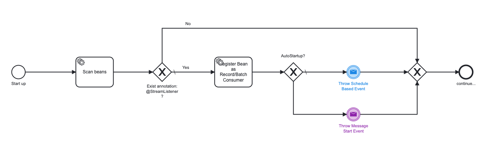

# Stream-Listener Library

## 1 - Introduction and Goals

* Event consumer should handle a large of numbers of events by pull the self. The all logic and configuration should be provided via plugin.

### Requirements Overview

* The all logic and configuration should be provided via plugin.
* Should handle a record consumer.
* Should handle a batch consumer.
* The pull and commit should be part of plugin.
* Usage of plugin should match nearly to Kafka Listener logic, since we want to migrate to kafka ASAP.

## 2 - Architecture Constraints

Inherited from bootstrap

## 3 - Context and scope

Producer and Consumer as decoupled services
The Event Producer subscribe for specific topic and get notified on new record(s) using the "stream-listenr-plugin".
Once record(s) are received it will send to the consumer configured on this topic via REST, and it will mark record(s)
as success or error regarding to the http status from event-consumer.

One best practice to decouple components is to use a stream and build an event based architecture (service choreography).
In such a service choreography the only communication path that exists is the connection of each service to the stream.
Each service then published events on the stream and don’t cares what happen with these records.
Other services subscribe to the stream and decide by their own how to react on a certain record.

Producer and Consumer as coupled services
The Event Producer/Consumer subscribe for specific topic and get notified on new record(s) using the "stream-listenr-plugin".
Once record(s) are received it will react on a certain record and it will mark it
as success or error regarding to the exception handling on event-consumer.

The Monolithic architecture were every function and action of the application is tied to a single and usually very large codebase.

### Business context

This library should be used in other implementation and speed up the development.

### Technical context

Event HUB Batch Service (Stateless)  [PULL]
Consumers pull events in batch modus from REST Service

Rest Service may get data from database (current) or from Message broker (later)

Consumer need to configure the Event-Category, Name, Version, etc.

## 4 - Solution Strategy

....

## 5 - Building Block View

### Level 1

## 6 - Runtime View

## 7 - Deployment view

Inherited from bootstrap

## 8 - Crosscutting Concepts

Inherited from bootstrap

## 9 - Architecture Decisions

Inherited from bootstrap

## 10 - Quality Requirements

> This section contains all quality requirements as quality tree with scenarios. The most important ones have already been described in section 1.2. (quality goals)
> Here you can also capture quality requirements with lesser priority, which will not create high risks when they are not fully achieved.

### Quality Tree

### Quality Scenarios

| Test Scenario | Description | Status | Link
| ------------ | ----------- | ------ | ------ 
| Pull Event for given Consumer-ID | It call REST API endpoint by given worker-id and get only event specified for given customer-id | Done |[Link to Document](https://confluence.microtema.net/display/DX/Test+Customer-InternetAccount)
| Commit results for given customer-id | It call REST API endpoint by given worker-id and release (locked) event specified for given customer-id | Done |[Link to Document](https://confluence.microtema.net/display/DX/Test+Customer-InternetAccount)

## 11 - Risks and Technical Debt

Inherited from bootstrap

## 12 - Glossary

| Term | Description | 
| ---- | ----------- | 
| Event-Streaming | ? |
| ? | ? |

Feedback and pull-requests welcome!

## Technology Stack

* Java 17
    * Streams
    * Lambdas
* Third Party Libraries
    * Commons-Lang3 (Apache License)
    * Jackson XML Databind (Apache License)
    * Junit (EPL 1.0 License)
* Code-Analyses
    * Sonar
    * Jacoco

## License

MIT (unless noted otherwise)

## Test Coverage

95 %
